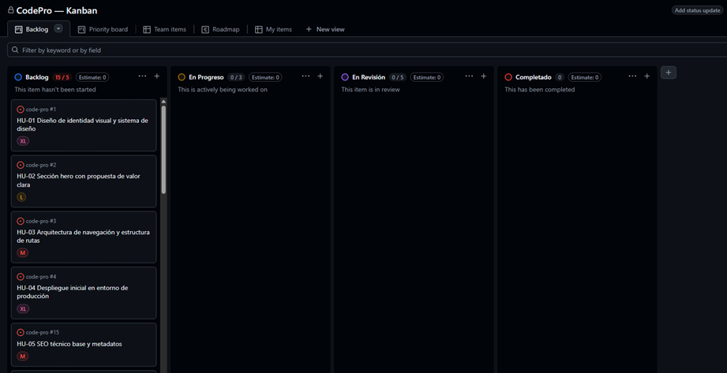
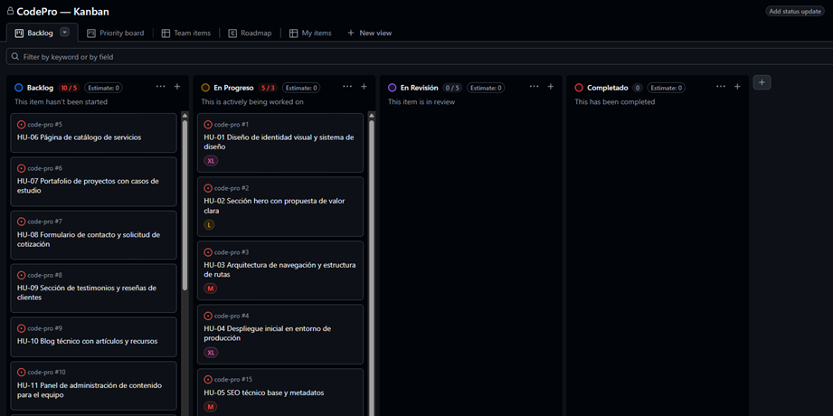
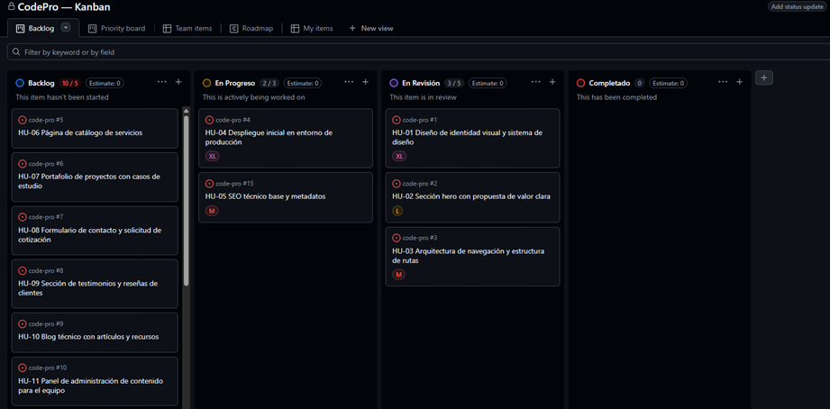
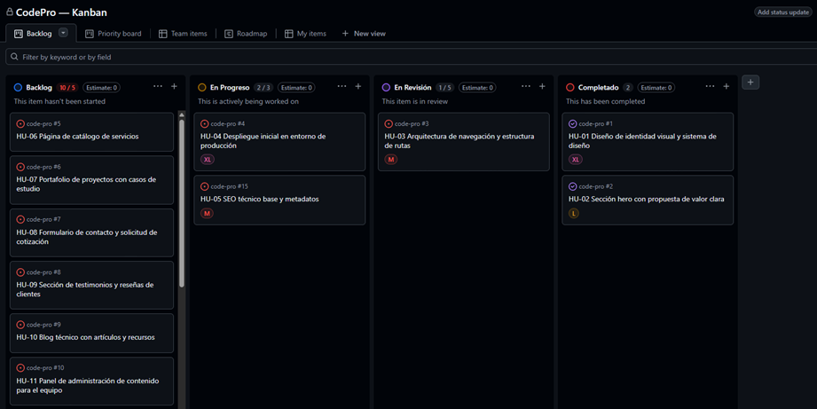
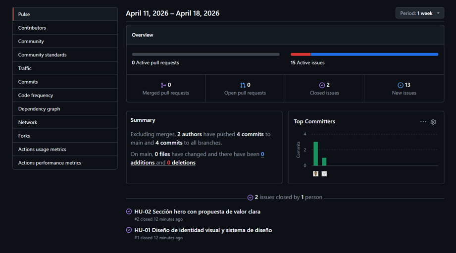
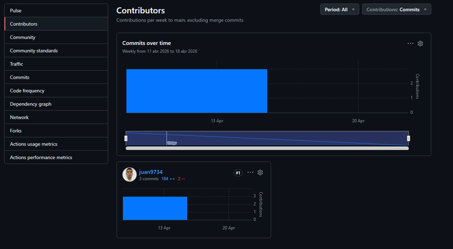
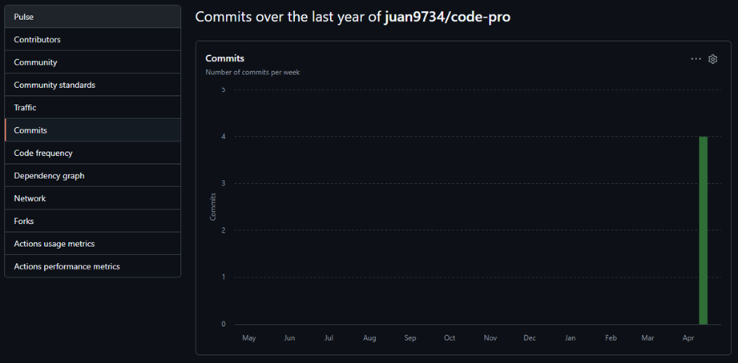
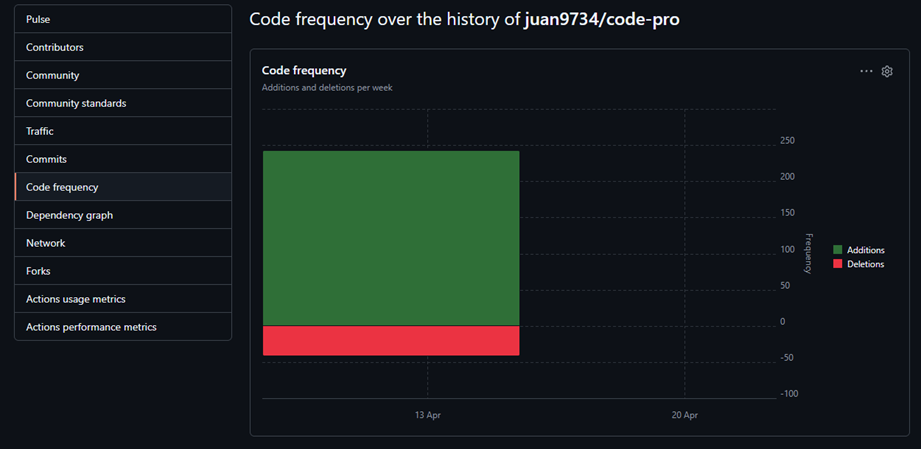

# Informe de Progreso — Sprint 1

## 1. Resumen del Sprint

| Campo               | Detalle             |
| ------------------- | ------------------- |
| Fecha de inicio     | 18 de abril de 2025 |
| Fecha de fin        | 21 de abril de 2025 |
| Issues planificados | 5                   |
| Issues completados  | 2                   |
| Issues en revisión  | 1                   |
| Issues en progreso  | 2                   |

---

## 2. Estado del Tablero Kanban

**Distribución actual de issues:**

- **Backlog:** issues restantes sin iniciar en este sprint
- **En Progreso:** HU-03, HU-04, HU-05 — funcionalidades en desarrollo activo
- **En Revisión:** HU-03 — pendiente de validación contra criterios de aceptación
- **Completado:** HU-01, HU-02 — cerrados oficialmente en GitHub

---

## 3. Análisis de GitHub Insights

### 3.1 Pulse

**Interpretación:**
El Pulse muestra un resumen de la actividad reciente del repositorio durante el sprint.
Se registraron 3 commits, 2 issues cerrados y 5 issues abiertos en el período para el sprint 1.
La actividad refleja un ritmo concentrado al inicio.

---

### 3.2 Contributors

**Interpretación:**
El gráfico de Contributors muestra que el repositorio cuenta con 1 contribuidor.
Al ser un proyecto individual, toda la actividad de commits está concentrada en un solo
autor. En un equipo real, esta vista permitiría identificar si el trabajo está distribuido equitativamente.

---

### 3.3 Frecuencia de Commits

**Interpretación:**
El gráfico de commits muestra picos de actividad a lo largo
del tiempo. Se observa que la mayoría de los commits se realizaron al inicio durante el sprint.
En un sprint ideal, los commits deberían estar distribuidos a lo largo de las semanas para reflejar avance continuo.

---

### 3.4 Code Frequency

**Interpretación:**
El gráfico de Code Frequency muestra las líneas agregadas (verde) vs. líneas eliminadas
(rojo) por semana. Se puede observar que
hubo más adiciones que eliminaciones, lo que sugiere una fase de construcción inicial.
Una alta tasa de eliminaciones podría indicar refactorización o corrección de errores.

---

## 4. Reflexión

**¿Qué te dice el tablero sobre el ritmo de avance del Sprint?**

El tablero Kanban refleja un avance parcial del sprint. Con 2 issues completados,
3 aún en proceso y 1 en revisión, avancé de manera progresiva. Sin embargo,
completar solo 2 de los 5 issues planificados sugiere que la estimación inicial fue
optimista o que surgieron bloqueos durante el desarrollo.

**¿Qué harías diferente en el Sprint 2?**

En el Sprint 2 se buscaría dividir las historias de usuario en tareas más pequeñas
para facilitar su movimiento por el tablero y tener mayor visibilidad del progreso
real. También se realizarían commits más frecuentes para que las métricas de Insights
reflejen mejor el trabajo realizado día a día.

**¿Qué limitación encontraste al usar GitHub Insights con un repositorio nuevo o individual?**

La principal limitación es que un repositorio nuevo o con poca actividad genera gráficos
casi vacíos, lo que dificulta la interpretación. Insights está diseñado para proyectos
con historia acumulada y múltiples contribuidores. En un contexto individual,
los datos son escasos y no representan un flujo de trabajo real de equipo.

---

## 5. Evidencia de Issues Cerrados

- [Issue #1 — HU-01: Diseño de identidad visual y sistema de diseño](https://github.com/juan9734/code-pro/issues/1)
- [Issue #2 — HU-02: Sección hero con propuesta de valor clara](https://github.com/juan9734/code-pro/issues/2)
